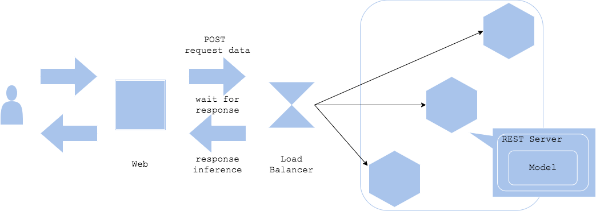

# Synchronous Pattern

## 유즈케이스

- 비즈니스 로직 중 모델의 추론이 다음 로직의 진행을 위해 필요할 때
- 워크플로우가 모델의 추론 결과에 의존할 때

 

## 아키텍처

**Synchronous Pattern**은 모델 추론을 동기적으로 수행할 때 사용되는 패턴입니다. 본 패턴에서는 모델이 추론을 마칠 때 까지 워크플로우가 블락됩니다.

REST (혹은 gRPC) 인터페이스를 활용해 인퍼런스 서버를 구축하는 경우, 이는 대개 **Synchronous Pattern**일 것입니다. **Synchronous Pattern**은 워크플로우를 스텝 단위로 간단하게 시각화할 수 있으므로, 가장 사용하기 쉬운 패턴 중의 하나입니다.

 

## 다이어그램

 

## 장점

- 간결한 구조로 관리의 용이
- 모델 추론을 마칠 때 까지 프로세스를 진행시키지 않으므로 서비스 워크플로우가 간단해짐

 

## 단점

- 모델 추론에서 발생하는 시간 지연이 성능의 병목이 될 수 있음
- 모델 추론에서 발생하는 시간 지연으로 인해 사용자 경험이 저하되지 않도록 고민해야 함

 

## 고려사항

- 사용자 경험을 저하시키지 않기 위한 방안
- 추론이 너무 길어질 경우의 타임아웃
