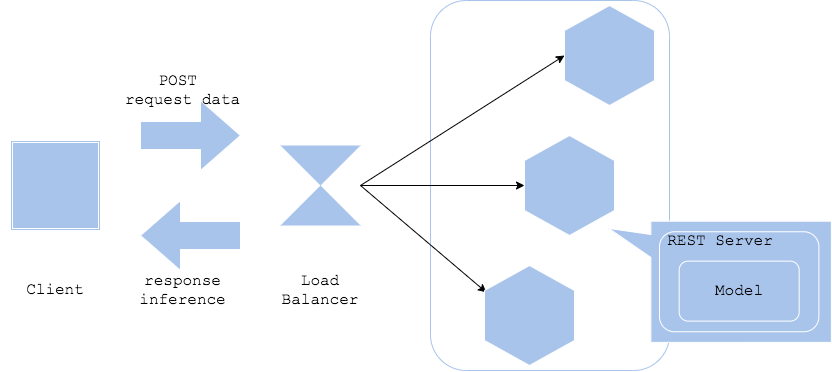

# Web Single Pattern

```shell
curl -X GET "http://0.0.0.0:8080/predict/test"
curl -X POST "http://0.0.0.0:8080/predict" -H  "accept: application/json" -H  "Content-Type: application/json" -d "{\"data\":\"자연어 처리는 재미있다.\"}"
```

<br>

## 유즈케이스

가장 간단한 구조로 예측 모델을 빠르게 배포하고자 할 때

<br>

## 아키텍처

**Web Single Pattern**은 모델 예측을 위한 모든 구성 요소와 코드를 **하나의 웹 서버**에 몰아 넣는 아키텍처입니다. REST (혹은 gRPC) 인터페이스, 전처리 로직, 모델 등이 모두 한 곳에 존재하므로 여러분은 간단하게 예측 모델을 생성하고 배포할 수 있습니다.

만약 여러 대의 복제 서버를 배포하고자 한다면, 해당 서버들을 로드밸런서 혹은 프록시 뒷단에 배포해야 합니다. 이때 gRPC 인터페이스를 사용하고 있다면, [클라이언트 사이드 로드밸런싱](https://grpc.io/blog/grpc-load-balancing/#proxy-or-client-side) 혹은 Layer-7 로드밸런서를 고려하면 좋습니다.

<br>

## 다이어그램



<br>

## 장점

- 웹 서버, 전처리, 추론 등의 로직을 하나의 프로그래밍 언어로 작성 가능
- 관리 및 트러블슈팅에 용이
- 모델 학습 이후, 프로덕션까지 이어지는 시간이 짧음
- 첫 번째 프로덕션 아키텍처로는 동기 구조의 Web Single Pattern을 가져가는 것이 일반적

<br>

## 단점

- 모든 컴포넌트가 하나의 서버 혹은 Docker 이미지에 포함되므로, 작은 코드 수정이 전체 이미지의 수정으로 이어지게 됨

<br>

## 고려사항

- 개별 컴포넌트의 업데이트와 유지보수 절차
- 웹 서버의 스케일 변경 관리